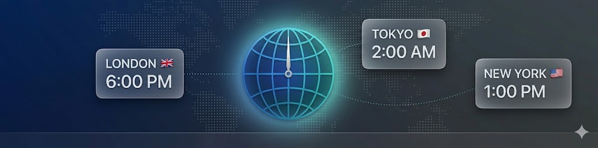
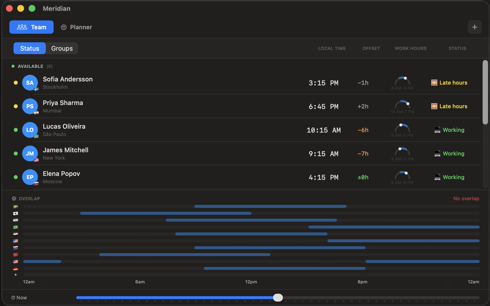
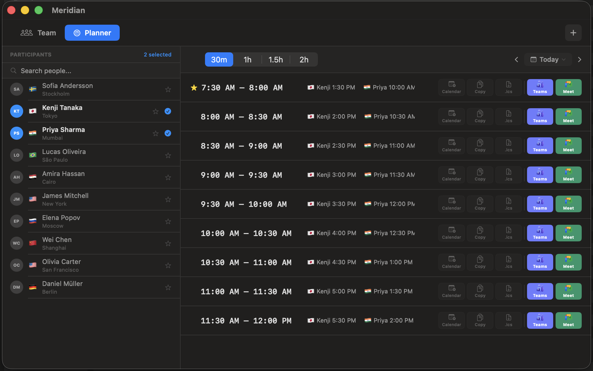

  

  <strong>Time zone coordination for remote teams</strong> 
  See who's available, find meeting overlaps, and plan across time zones. One glance from your menu bar.

  
  

  
  
  
  

  
  

  Built with Swift and SwiftUI. No Electron, no web views, no bloat.

---

## Screenshots

  
  &nbsp;&nbsp;
  

---

## Download

Purchase Meridian from [**Gumroad**](https://store.beyondthecode.app/l/meridian-macos) ($12 one-time). You'll receive a license key by email. Download the app, enter your key, and you're set.

Your license works on up to 3 Macs at a time. You can deactivate devices from Settings.

The app includes a built-in update checker -- open **About** and click **Check for Updates** to see if a newer version is available.

## Features

- **Team Roster** -- Add your team members with their time zones. See availability status at a glance: working, late hours, off, or sleeping.
- **Day Arc Visualization** -- Semicircular sun position shows where each person is in their day. Toggle between filled and outline styles.
- **Overlap Band** -- Stacked working hours at the bottom of the team view. Highlighted overlap shows when everyone (or most) are available.
- **Time Slider** -- Preview future hours with a drag slider. 30-minute snaps, shows how availability changes throughout the day.
- **Meeting Planner** -- Select participants, set duration, and filter by availability preference (all working, at least N, any overlap). Auto-ranked best slots with star indicator.
- **Calendar Integration** -- Optional Calendar.app integration shows busy times with hatching overlay in the planner. Requires calendar permission.
- **Google Meet & Microsoft Teams** -- Automatically generate meeting invites directly from the planner. Pick a time slot, choose your platform, and share.
- **Copy Formatted Times** -- One click to copy meeting times formatted for each participant's time zone. Plain text and rich text.
- **Groups** -- Organize team members into groups. Filter the team view and planner by group.
- **Desktop Widgets** -- Small, medium, and large WidgetKit widgets. Configurable per group. Shows team status, day arcs, and overlap info.
- **Menu Bar** -- Globe icon with optional live count indicator. Three display styles.
- **Notifications** -- Workday-started alerts and overlap reminders. Quiet hours suppression.
- **Themes** -- Light, dark, and system appearance. Custom accent color. Compact mode.
- **Multi-Device Licensing** -- Activate on up to 3 Macs. Self-service deactivation from Settings.

## Requirements

| | Requirement |
|---|---|
| **OS** | macOS 14.0 (Sonoma) or later |
| **Chip** | Any Mac (Apple Silicon or Intel) |
| **License** | $12 one-time via [Gumroad](https://store.beyondthecode.app/l/meridian-macos) |

## Getting Started

### 1. Purchase and download

Buy Meridian from [Gumroad](https://store.beyondthecode.app/l/meridian-macos). Download the `.zip`, extract it, and move `Meridian.app` to your Applications folder.

### 2. Activate

Launch Meridian and enter the license key from your Gumroad purchase email. Click **Activate**.

### 3. Add your team

Click the **+** button to add team members. Set their name, time zone, and working hours.

## FAQ

### macOS asks for my keychain password on first launch

On first launch you may see a prompt saying *"Meridian wants to use your confidential information stored in your keychain."* This is expected -- Meridian stores an encryption key in your login keychain to protect your team data (names, time zones, working hours) with AES-256 encryption. It also stores your license key in the keychain. Click **Always Allow** so you won't be asked again.

### macOS asks to "access data from other apps"

If you enable the Calendar integration in the Meeting Planner, macOS will ask *"Meridian would like to access data from other apps."* This is required to read your Calendar.app events and show busy times in the planner. Click **Allow** to enable it. Calendar access is optional -- the app works fully without it.

## Support

- [Report an Issue](https://github.com/beyondthecode-bc/Meridian/issues)
- [Website](https://beyondthecode.app)
- [GitHub Sponsors](https://github.com/sponsors/beyondthecode-bc)
- [Buy Me a Coffee](https://www.buymeacoffee.com/BEYONDTHECODE)
